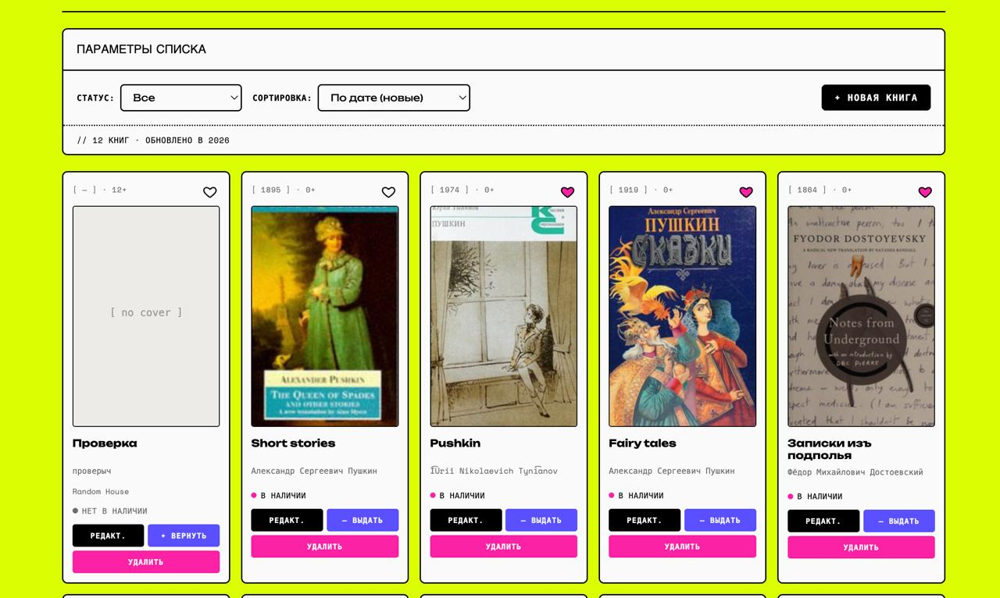
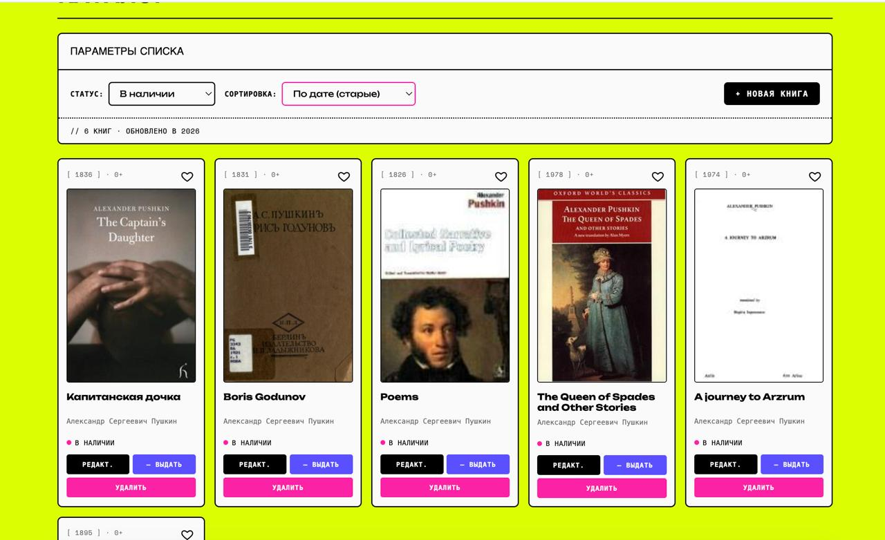
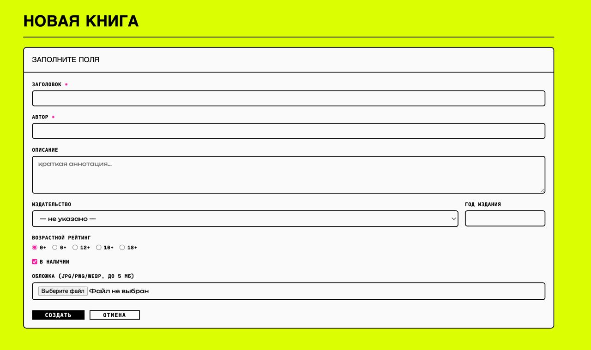
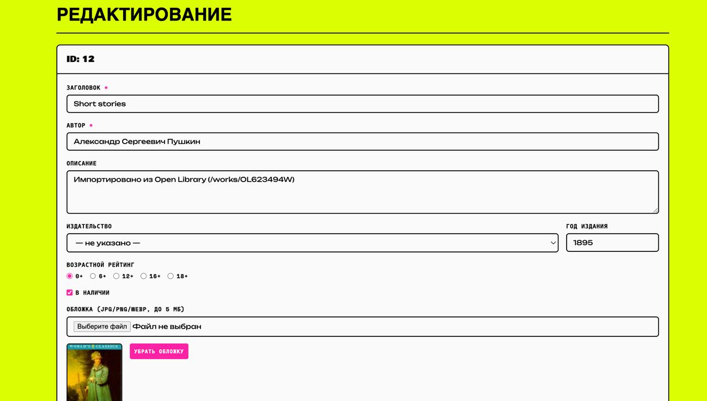
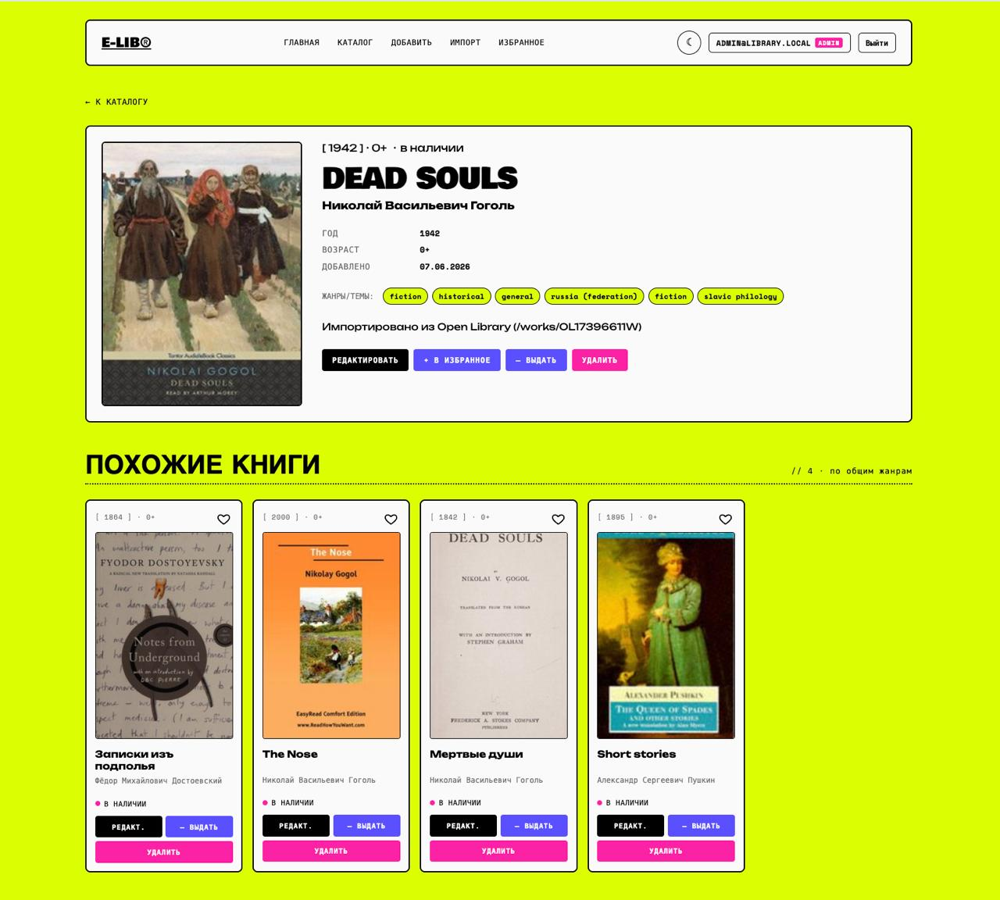
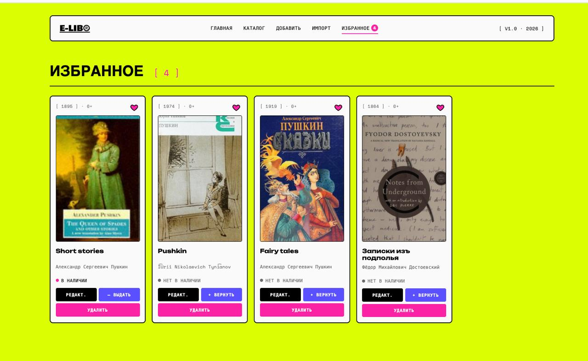
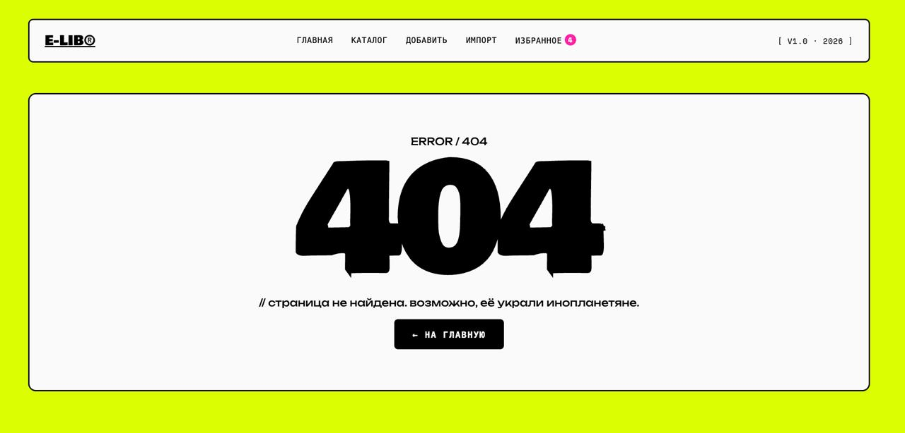
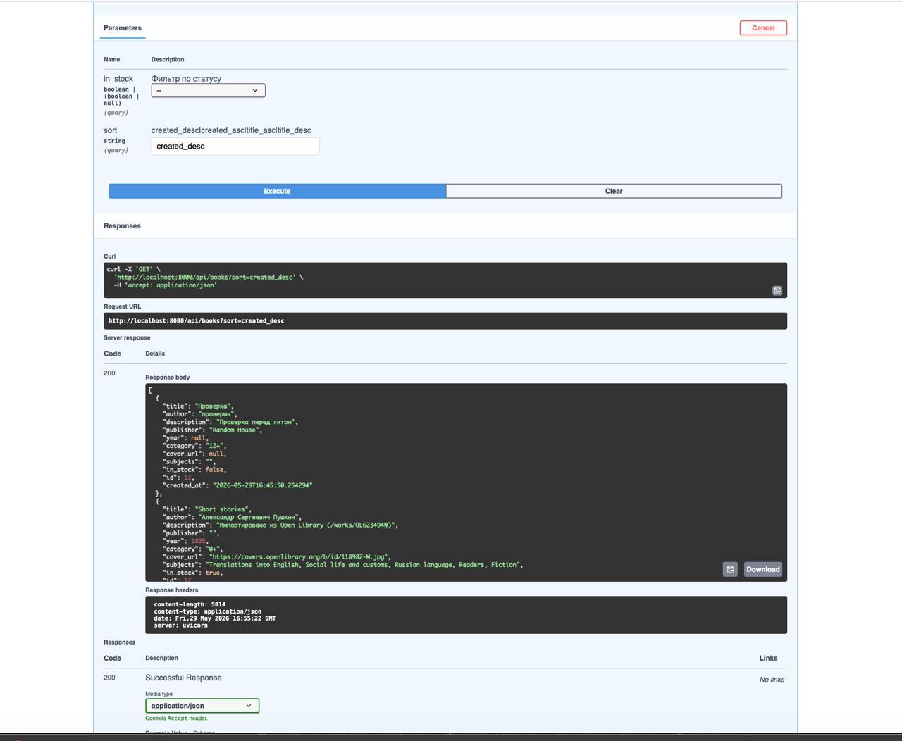
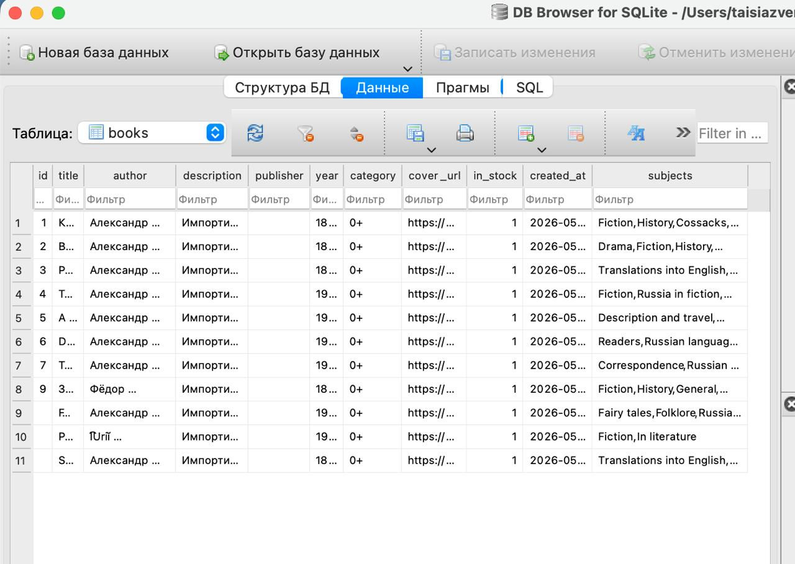

# ElectoLibrary — Электронная библиотека

SPA-приложение на **Vue 3** с серверной частью на **FastAPI** и СУБД **SQLite**.
Учебный проект, реализующий полный CRUD каталога книг с дополнительными возможностями:
импорт из Open Library API, избранное на localStorage, рекомендации похожих книг
по жанровым тегам.

---

## 1. Титульная часть

| | |
|---|---|
| **Автор** | tessaiqo |
| **Группа** | №1 |
| **Дата** | 2026 |
| **Название работы** | Разработка SPA-приложения на Vue 3 с сервером на Python |

---

## 2. Цель работы

Освоить ключевые возможности экосистемы Vue 3 и серверной разработки на Python,
а именно:

- Реактивная привязка данных, события, `computed`, `watch`, ref'ы и жизненный цикл.
- Декомпозиция UI на компоненты с `props`, `emits` и тремя видами слотов.
- Маршрутизация Vue Router: статические, динамические, вложенные и именованные
  маршруты, программная навигация, страница 404.
- Работа с формами (`v-model` с модификаторами `.trim`, `.number`, валидация,
  загрузка файлов).
- HTTP-взаимодействие с REST API (axios).
- Базовая серверная разработка: ORM SQLAlchemy, Pydantic-схемы, асинхронные
  HTTP-клиенты, отдача статических файлов, CORS.
- Контейнеризация: multi-stage Docker-сборка фронта, отдельный образ бэка,
  оркестрация через docker-compose, тома для персистентного хранения.

---

## 3. Стек технологий

| Слой       | Технологии                                                |
|------------|-----------------------------------------------------------|
| Frontend   | Vue 3 (Options API), Vite 8, Vue Router 4, axios          |
| Backend    | FastAPI, Uvicorn, SQLAlchemy 2.x, Pydantic 2.x, httpx     |
| Хранение   | SQLite (файл `data/library.db`), файлы обложек в `uploads/` |
| Внешнее API| Open Library Search API                                   |
| Инфра      | Docker, docker-compose, Nginx (для отдачи production-сборки) |
| Шрифты     | Bowlby One, Unbounded, Space Mono (Google Fonts)          |

---

## 4. Структура репозитория

```
ebook-library/
├── backend/
│   ├── main.py             # FastAPI приложение + все эндпоинты
│   ├── models.py           # ORM-модель Book
│   ├── schemas.py          # Pydantic-схемы (BookCreate, BookOut, ...)
│   ├── database.py         # Подключение SQLAlchemy + get_db()
│   ├── requirements.txt
│   └── Dockerfile
├── frontend/
│   ├── src/
│   │   ├── components/
│   │   │   ├── AppHeader.vue       # Верхнее меню
│   │   │   ├── AppFooter.vue       # Подвал с именованным слотом
│   │   │   ├── LayoutCard.vue      # Обёртка с 3 видами слотов
│   │   │   ├── BookItem.vue        # Карточка одной книги
│   │   │   ├── BookList.vue        # Сетка книг
│   │   │   └── BookForm.vue        # Форма создания/редактирования
│   │   ├── views/
│   │   │   ├── HomeView.vue        # /
│   │   │   ├── BooksView.vue       # /books (со вложенным RouterView)
│   │   │   ├── BookDetailView.vue  # /books/:id
│   │   │   ├── BookFormView.vue    # /books/new и /books/:id/edit
│   │   │   ├── ImportView.vue      # /books/import (вложенный)
│   │   │   ├── FavoritesView.vue   # /favorites
│   │   │   └── NotFoundView.vue    # 404
│   │   ├── router/index.js         # Vue Router
│   │   ├── services/api.js         # axios-клиент
│   │   ├── composables/
│   │   │   └── useFavorites.js     # Composable: избранное в localStorage
│   │   ├── assets/styles.css       # Глобальные стили
│   │   ├── App.vue                 # Корневой компонент
│   │   └── main.js
│   ├── public/favicon.svg
│   ├── index.html
│   ├── vite.config.js
│   ├── nginx.conf                  # Конфиг Nginx для production
│   ├── Dockerfile                  # Multi-stage сборка
│   └── package.json
├── data/                           # SQLite БД (создаётся при первом запуске)
├── uploads/                        # Загруженные обложки
├── docs/imgs/                      # Скриншоты для отчёта
├── docker-compose.yml
└── README.md
```

---

## 5. Реализованный функционал

### 5.1. Компоненты

| Компонент | Назначение | Возможности Vue, которые демонстрирует |
|---|---|---|
| `AppHeader.vue` | Верхняя навигация | RouterLink с `active-class`, реактивный счётчик избранного |
| `AppFooter.vue` | Подвал | **Именованный слот** `links` для кастомизации содержимого |
| `LayoutCard.vue` | Обёртка-карточка | **Все три типа слотов**: дефолтный, именованный (`header`), scoped (`footer` с `year` и `items`) |
| `BookItem.vue` | Карточка книги | `props` (`book`), `emits` (`edit`, `delete`, `toggle`), `computed` (`coverUrl`, `fav`), интеграция с composable |
| `BookList.vue` | Сетка карточек | `props` (массив), проброс событий вверх через `$emit('event', $event)` |
| `BookForm.vue` | Форма создания/редактирования | `v-model.trim` / `.number`, валидация, refs (`fileInput`), `watch` на `initial`, загрузка файлов через `FormData` |

### 5.2. Маршрутизация (Vue Router)

Все требования ТЗ покрыты в `src/router/index.js`:

| Маршрут | Имя | Тип | Назначение |
|---|---|---|---|
| `/` | `home` | статический именованный | Главная |
| `/books` | `books` | именованный | Каталог |
| `/books/import` | `books-import` | **вложенный** под `/books` | Импорт из Open Library |
| `/books/new` | `book-new` | статический именованный | Создание книги |
| `/books/:id` | `book-detail` | **динамический** с `props: true` | Детальная книги |
| `/books/:id/edit` | `book-edit` | динамический + `props: true` | Редактирование |
| `/favorites` | `favorites` | именованный | Избранное |
| `/:pathMatch(.*)*` | `not-found` | catch-all | **Страница 404** |

**Программная навигация** используется в нескольких местах:
- `this.$router.push({ name: 'book-edit', params: { id: book.id } })` — переход на редактирование из каталога;
- `this.$router.push({ name: 'books' })` — редирект после успешного создания/удаления.

**Hook `afterEach`** в роутере подставляет правильный `<title>` страницы из `to.meta.title`.

### 5.3. computed, watch, refs, жизненный цикл

**`computed`** — реактивные производные данные:
- `BooksView.filteredBooks` — применяет текущий фильтр и сортировку к массиву книг;
- `BookDetailView.tagsArray` — разбивает CSV-строку тегов на массив;
- `BookDetailView.similarBooks` — алгоритм поиска похожих (см. ниже);
- `AppHeader.favCount` — реактивный счётчик избранного (через composable).

**`watch`**:
- В `BooksView` — на `$route`, чтобы перезагружать список при возврате на `/books`;
- В `BookForm` — на `initial` с `immediate: true`, чтобы подхватить данные книги при редактировании (асинхронная загрузка);
- В `BookDetailView` — на `id` (с `immediate: true`), чтобы перезагружать данные при переходе между похожими книгами.

**Refs** — `BookForm` использует `ref="fileInput"` для программной очистки `<input type="file">` после удаления обложки.

**Жизненный цикл** — `mounted()` для начальной загрузки данных в большинстве views.

### 5.4. Слоты — все три вида

Реализованы в `LayoutCard.vue`:

```vue
<!-- Именованный слот -->
<slot name="header" />

<!-- Дефолтный (обычный) слот -->
<slot />

<!-- Slot scope: компонент передаёт данные обратно в шаблон родителя -->
<slot name="footer" :year="currentYear" :items="itemsCount" />
```

Использование scope-слота в `BooksView`:

```vue
<template #footer="{ year, items }">
  // {{ items }} {{ pluralBooks(items) }} · обновлено в {{ year }}
</template>
```

В `AppFooter.vue` — **именованный слот** `links`, наполняемый из `App.vue`.

### 5.5. Формы и валидация

`BookForm.vue` содержит все элементы ввода, перечисленные в ТЗ:

| Поле | Элемент | Особенности |
|---|---|---|
| Заголовок | `<input>` + `v-model.trim` | Обязательное, мин. 2 символа |
| Автор | `<input>` + `v-model.trim` | Обязательное, мин. 2 символа |
| Описание | `<textarea>` + `v-model.trim` | Необязательное |
| Издательство | `<select>` | Выбор из списка |
| Год | `<input type="number">` + `v-model.number` | Числовая проверка, 0–2100 |
| Категория | `<input type="radio">` | 0+, 6+, 12+, 16+, 18+ |
| В наличии | `<input type="checkbox">` | Булево |
| Обложка | `<input type="file">` | Только jpg/png/webp, лимит 5 МБ, загружается отдельным запросом |

**Валидация** — собственный метод `validate()`, проверяет обязательные поля и
диапазон года. При ошибках поля подсвечиваются классом `.is-error`, под ними
выводится текст ошибки. Кнопка сабмита блокируется на время загрузки обложки
и отправки формы.


### 5.6. Поиск, фильтрация и сортировка

В `BooksView` реализованы три механизма уточнения каталога, работающие **в комбинации** (поиск → фильтр → сортировка), всё через один `computed.filteredBooks`:

- **Поиск по тексту** — по `title` и `author` одновременно, регистронезависимый (`toLowerCase`).
- **Фильтр по статусу** — «Все» / «В наличии» / «Нет в наличии».
- **Сортировка** — по дате добавления (новые/старые) и по алфавиту названия (А→Я, Я→А, через `localeCompare(_, 'ru')` для корректной русской сортировки).

Изменение любого параметра мгновенно перерисовывает список без обращения к серверу — данные уже загружены в `this.books`.

#### Debounce поиска (250 мс)

Поиск по тексту реализован с **дебаунсом** через пару переменных в `data`:

```js
data() {
  return {
    searchQuery: '',       // то, что пользователь печатает прямо сейчас
    debouncedQuery: '',    // «успокоенное» значение для фильтрации
    debounceTimer: null
  }
}
```

И watcher, который откладывает обновление `debouncedQuery` на 250 мс после последнего нажатия клавиши:

```js
watch: {
  searchQuery(val) {
    clearTimeout(this.debounceTimer)
    this.debounceTimer = setTimeout(() => {
      this.debouncedQuery = val
    }, 250)
  }
}
```

Computed-свойство `filteredBooks` зависит от `debouncedQuery`, а не от «сырого» `searchQuery`. Поле ввода привязано к `searchQuery` через `v-model` — поэтому реакция в UI (отображение введённого текста, появление кнопки «×») происходит мгновенно, а реальная фильтрация — только после паузы.

**Зачем это нужно:**

| Без дебаунса | С дебаунсом 250 мс |
|---|---|
| Каждое нажатие клавиши вызывает пересчёт `filteredBooks`. | Пересчёт происходит один раз — после того, как пользователь перестал печатать. |
| При вводе слова из 10 букв — 10 проходов по массиву и 10 перерисовок DOM. | 1 проход и 1 перерисовка. |
| На больших каталогах (сотни книг) ощущается как «лаги» в инпуте. | Ввод остаётся плавным независимо от размера каталога. |

**Почему именно 250 мс:** это эмпирически найденный «комфортный» порог в UI-разработке. Меньше 150 мс — дебаунс почти не имеет эффекта; больше 400 мс — пользователю кажется, что приложение «думает» и отстаёт. 200–300 мс — стандартный диапазон для поисковых полей в продакшн-приложениях (используется, например, в GitHub, Notion, Linear).

**Почему не throttle:** throttle вызывал бы функцию через равные интервалы во время печати, что нам не нужно — нам нужно дождаться, когда пользователь закончит печатать. Debounce — правильный паттерн именно для поиска.

**Защита от утечек:** в `beforeUnmount` вызывается `clearTimeout(this.debounceTimer)`, чтобы при уходе со страницы во время набора текста таймер не сработал на уже размонтированном компоненте.

#### Условный рендеринг пустых списков

Реализованы две разные пустые заглушки:

```vue
<div v-if="searchQuery && filteredBooks.length === 0" class="empty">
  // ничего не найдено по запросу «{{ searchQuery }}»
</div>
```

— и стандартная пустая заглушка внутри `BookList`, когда каталог в целом пуст. Это даёт пользователю чёткий контекст: «совсем нет книг» — это не то же самое, что «нет результатов по этому запросу».

### 5.7. Избранное (localStorage)

Реализовано через **Composition API composable** `src/composables/useFavorites.js`:

- Хранилище — единый `reactive Set` в модуле (singleton-pattern на уровне модуля).
- Любой компонент, вызывающий `useFavorites()`, подписан на изменения.
- При каждом изменении синхронизируется с `localStorage` (ключ `electolibrary:favorites`).
- Метод `syncWith(existingIds)` очищает «висящие» ID, которых уже нет в БД.
- В `BooksView.confirmDelete` после удаления книги вызывается `favRemove(book.id)` — id уходит и из localStorage, и из БД одновременно.

UI: сердечко в правом верхнем углу карточки, бейдж со счётчиком в шапке,
отдельная страница `/favorites`.

### 5.8. Похожие книги

В `BookDetailView.similarBooks`:

1. Берём массив тегов текущей книги (`tagsArray` — CSV → массив).
2. Для каждой другой книги в каталоге считаем количество **общих тегов** (пересечение множеств в lowercase).
3. Сортируем по убыванию количества общих тегов, берём топ-4.
4. **Fallback**: если у текущей книги нет тегов вообще, возвращаем книги того же автора.

Подзаголовок секции динамически отражает критерий: «по общим жанрам» либо «тот же автор».

### 5.9. Импорт из Open Library

Страница `/books/import` (вложенный маршрут):
- Запрос идёт через свой бэкенд: `GET /api/openlibrary/search?q=...` → бэкенд проксирует на `https://openlibrary.org/search.json` с явным параметром `fields=key,title,author_name,first_publish_year,cover_i,subject` (без этого `subject` не возвращается).
- Результаты отрисовываются карточками; одним кликом «+ Импортировать» создаётся книга в нашей SQLite через `POST /api/books` — со всеми данными, обложкой и тегами.
- Защита от повторного импорта: уже добавленные книги (по комбинации `title|author`) помечаются «✓ В каталоге».

---

## 6. Серверная часть

### 6.1. CRUD-эндпоинты

Все обязательные методы реализованы. Документация автоматически генерируется
FastAPI и доступна по адресу `http://localhost:8000/docs` (Swagger UI).

| Метод | Путь | Описание |
|---|---|---|
| `GET`    | `/api/books`            | Список с опц. фильтром `?in_stock=true/false` и сортировкой `?sort=created_desc\|created_asc\|title_asc\|title_desc` |
| `GET`    | `/api/books/{id}`       | Одна книга (404 если не найдена) |
| `POST`   | `/api/books`            | Создать (201) |
| `PUT`    | `/api/books/{id}`       | Обновить (404 если не найдена) |
| `DELETE` | `/api/books/{id}`       | Удалить (204 No Content) |
| `POST`   | `/api/upload-cover`     | Multipart-загрузка файла обложки (jpg/png/webp, до 5 МБ). Возвращает `cover_url` |
| `GET`    | `/api/openlibrary/search` | Прокси-эндпоинт к Open Library |
| `GET`    | `/uploads/{filename}`   | Отдача загруженных обложек (StaticFiles) |
| `GET`    | `/api/health`           | Health-check |

### 6.2. Модель данных

`backend/models.py`:

```python
class Book(Base):
    __tablename__ = "books"
    id: Mapped[int]          = mapped_column(Integer, primary_key=True, autoincrement=True)
    title: Mapped[str]       = mapped_column(String(300), nullable=False)
    author: Mapped[str]      = mapped_column(String(300), nullable=False)
    description: Mapped[str | None] = mapped_column(Text, default="")
    publisher: Mapped[str | None]   = mapped_column(String(200), default="")
    year: Mapped[int | None]        = mapped_column(Integer, nullable=True)
    category: Mapped[str]    = mapped_column(String(20), default="0+")
    cover_url: Mapped[str | None]   = mapped_column(String(500), nullable=True)
    subjects: Mapped[str | None]    = mapped_column(Text, default="")  # CSV тегов
    in_stock: Mapped[bool]   = mapped_column(Boolean, default=True)
    created_at: Mapped[datetime]    = mapped_column(DateTime, default=datetime.utcnow)
```

### 6.3. Хранение данных

- **SQLite** в файле `data/library.db` — простая встраиваемая СУБД, не требует
  отдельного сервиса. Файл монтируется в Docker-контейнер через volume
  (`./data:/app/data`), благодаря чему данные **переживают пересборку и перезапуск
  контейнеров**.
- **Файлы обложек** — папка `uploads/` (тоже примонтирована как том). Имена
  файлов генерируются через `uuid.uuid4()`, чтобы избежать коллизий.
- При каждом POST/PUT/DELETE данные коммитятся (`db.commit()`), запись
  немедленно появляется в `.db`-файле. Можно открыть в **DB Browser for SQLite**
  и убедиться вручную.

### 6.4. Безопасность и корректность

- **CORS**: разрешён только для `http://localhost:3000`, `http://localhost`,
  `http://localhost:80` (разработка через Vite-прокси и production через Nginx).
- **Валидация на бэке**: Pydantic-схемы со строгими типами, `Field(..., min_length=1)`,
  `pattern` для категории.
- **Загрузка файлов**: проверка расширения (`.jpg/.jpeg/.png/.webp`) и размера
  (макс. 5 МБ). Чужие имена не используются — генерируется UUID.
- **SQL-инъекции невозможны** — везде используется ORM SQLAlchemy с параметризованными запросами.

---

## 7. Docker

### 7.1. Multi-stage сборка фронта (`frontend/Dockerfile`)

```dockerfile
# Stage 1: сборка через Node
FROM node:20-alpine AS build
WORKDIR /app
COPY package*.json ./
RUN npm install
COPY . .
RUN npm run build

# Stage 2: только Nginx + собранная статика
FROM nginx:alpine
COPY nginx.conf /etc/nginx/conf.d/default.conf
COPY --from=build /app/dist /usr/share/nginx/html
EXPOSE 80
CMD ["nginx", "-g", "daemon off;"]
```

Итоговый образ весит ~25 МБ (только nginx + статика). Node в финальном образе
отсутствует — соответствует best-practice минимизации поверхности атаки.

### 7.2. Nginx (`frontend/nginx.conf`)

Решает три задачи:

1. **Раздаёт собранный фронт** из `/usr/share/nginx/html`.
2. **Проксирует `/api/...` на бэкенд-контейнер**:
```nginx
   location /api {
       proxy_pass http://backend:8000;
   }
```
   Имя `backend` резолвится Docker'ом по сервису из docker-compose.
3. **SPA fallback** — `try_files $uri $uri/ /index.html;` — для корректной работы
   Vue Router в `history`-режиме (любой неизвестный URL отдаёт `index.html`,
   дальше клиентский роутер показывает нужную view или 404).

### 7.3. Backend Dockerfile

Минималистичный образ на `python:3.12-slim`. Папки `data/` и `uploads/`
создаются в Dockerfile (`RUN mkdir -p ...`), но реально перекрываются
volumes из compose.

### 7.4. docker-compose.yml

```yaml
services:
  backend:
    build: ./backend
    container_name: electolibrary-backend
    ports:
      - "8000:8000"
    volumes:
      - ./data:/app/data       # БД переживает пересборки
      - ./uploads:/app/uploads # Обложки тоже
    networks:
      - elib-net

  frontend:
    build: ./frontend
    container_name: electolibrary-frontend
    ports:
      - "80:80"
    depends_on:
      - backend
    networks:
      - elib-net

networks:
  elib-net:
    driver: bridge
```

`depends_on` гарантирует порядок старта, а общая сеть `elib-net` позволяет
nginx-у обращаться к бэкенду по имени `backend`.

---

## 8. Скриншоты интерфейса

### Главная


### Каталог


### Каталог с применённым фильтром


### Создание книги


### Редактирование


### Детальная страница книги (теги + похожие)


### Избранное


### Импорт из Open Library


### 404


### Swagger UI (документация API)


### Данные в DB Browser for SQLite


---

## 9. Примеры кода

### 9.1. Дочерний компонент с событиями (BookList → BookItem)

```vue
<!-- BookList.vue -->
<BookItem
  v-for="book in books"
  :key="book.id"
  :book="book"
  @edit="$emit('edit', $event)"
  @delete="$emit('delete', $event)"
  @toggle="$emit('toggle', $event)"
/>
```

### 9.2. Composable для избранного

```js
// useFavorites.js
import { reactive, computed } from 'vue'

const state = reactive({ ids: new Set(loadFromStorage()) })

export function useFavorites() {
  return {
    favoriteIds: computed(() => state.ids),
    count: computed(() => state.ids.size),
    isFavorite: (id) => state.ids.has(Number(id)),
    toggle: (id) => {
      const n = Number(id)
      state.ids.has(n) ? state.ids.delete(n) : state.ids.add(n)
      localStorage.setItem('electolibrary:favorites', JSON.stringify([...state.ids]))
    }
    // ...
  }
}
```

### 9.3. Computed с фильтрацией и сортировкой

```js
// BooksView.vue
filteredBooks() {
  let arr = [...this.books]
  if (this.filterStatus === 'in')  arr = arr.filter(b => b.in_stock)
  if (this.filterStatus === 'out') arr = arr.filter(b => !b.in_stock)
  const cmp = {
    created_desc: (a, b) => new Date(b.created_at) - new Date(a.created_at),
    title_asc:    (a, b) => a.title.localeCompare(b.title, 'ru'),
    // ...
  }
  return arr.sort(cmp[this.sortKey])
}
```

### 9.4. FastAPI: CRUD-эндпоинт

```python
@app.put("/api/books/{book_id}", response_model=schemas.BookOut)
def update_book(book_id: int, payload: schemas.BookUpdate, db: Session = Depends(get_db)):
    book = db.get(Book, book_id)
    if not book:
        raise HTTPException(status_code=404, detail="Книга не найдена")
    for field, value in payload.model_dump().items():
        setattr(book, field, value)
    db.commit()
    db.refresh(book)
    return book
```

### 9.5. Пример строки в SQLite

```json
{
  "id": 1,
  "title": "The Hobbit",
  "author": "J. R. R. Tolkien",
  "description": "Импортировано из Open Library (/works/OL27482W)",
  "publisher": "",
  "year": 1937,
  "category": "0+",
  "cover_url": "https://covers.openlibrary.org/b/id/14627509-M.jpg",
  "subjects": "Fiction, Fantasy fiction, Adventure, English fiction, Hobbits",
  "in_stock": true,
  "created_at": "2026-05-29T18:42:11"
}
```

---

## 10. Инструкция по запуску

### Вариант 1 — через Docker (рекомендуется)

Требования: **Docker Desktop**.

```bash
git clone https://github.com/tessaiqo/electolibrary.git
cd electolibrary
docker compose up --build
```

Открыть в браузере: **http://localhost** (фронт) и **http://localhost:8000/docs** (Swagger).

Остановка:

```bash
docker compose down
```

Данные сохраняются в `./data/library.db` и `./uploads/` благодаря volume-маунтам.

### Вариант 2 — локально (для разработки)

Требования: **Node.js 20+**, **Python 3.12+**.

**Бэкенд** (терминал 1):

```bash
cd backend
python3 -m venv venv
source venv/bin/activate
pip install -r requirements.txt
uvicorn main:app --reload --port 8000
```

**Фронтенд** (терминал 2):

```bash
cd frontend
npm install
npm run dev
```

Открыть: **http://localhost:3000**. Vite-сервер сам проксирует `/api` на `localhost:8000` (см. `vite.config.js`).

### Production-сборка фронта

```bash
cd frontend
npm run build      # результат в dist/
npm run preview    # быстрая проверка собранной версии
```

---

## 11. Возможные расширения

В рамках учебной работы реализован минимальный набор. В прод-версии стоило бы:

- Заменить SQLite на PostgreSQL для конкурентного доступа.
- Хранить избранное в БД с привязкой к пользователю (потребует авторизации).
- Кэшировать ответы Open Library (Redis или встроенный LRU) — каждый запрос
  сейчас идёт во внешний API.
- Покрыть бэк тестами (pytest + httpx.AsyncClient).
- Добавить пагинацию для длинных каталогов.
- Реализовать загрузку обложек на S3-совместимое хранилище.

---

## 12. Выводы

В ходе работы освоены и применены:

- **Vue 3** — структура SPA, реактивная привязка, computed/watch, жизненный цикл,
  refs, Options API в сочетании с Composition API (composables).
- **Компонентный подход** — декомпозиция UI, передача данных через `props`,
  обратное взаимодействие через `emits`, повторное использование через слоты
  (включая scope).
- **Маршрутизация Vue Router** — статические, динамические и вложенные маршруты,
  программная навигация, обработка 404, передача параметров через `props`.
- **Работа с формами** — `v-model` с модификаторами, валидация, загрузка файлов
  через `FormData` и `multipart/form-data`.
- **REST API** — спроектирован и реализован CRUD по REST-конвенциям, статус-коды,
  возврат 404/201/204 в правильных местах.
- **FastAPI** — Pydantic-валидация на входе и выходе, dependency injection
  (`Depends(get_db)`), асинхронные эндпоинты с httpx, автогенерация Swagger UI.
- **SQLAlchemy 2.x** — современный синтаксис с `Mapped[T]`, сессии, ORM-запросы.
- **Docker** — multi-stage сборка для минимизации образа, оркестрация
  compose-файлом, volumes для персистентности, общая сеть для коммуникации
  сервисов по DNS-имени.
- **Структурирование SPA-проекта** — разделение на views/components/services/
  composables, изоляция бизнес-логики от UI.

---

## 13. Источники

- [Vue 3 Documentation](https://vuejs.org/)
- [Vue Router 4](https://router.vuejs.org/)
- [Vite](https://vitejs.dev/)
- [FastAPI](https://fastapi.tiangolo.com/)
- [SQLAlchemy 2.0](https://docs.sqlalchemy.org/en/20/)
- [Open Library Developers — Search API](https://openlibrary.org/developers/api)
- [Docker Compose](https://docs.docker.com/compose/)