# 📚 ElectoLibrary — Электронная библиотека

SPA-приложение электронной библиотеки на **Vue 3 + FastAPI + SQLite**. Учебный
проект с полным набором функций: CRUD-каталог, поиск с дебаунсом, фильтрация
и сортировка, избранное, импорт из Open Library API, JWT-авторизация с ролями,
тёмная тема, drag-and-drop загрузка обложек, клавиатурные шорткаты и многое
другое.


---

## 📋 Содержание

1. [Титульная часть](#1-титульная-часть)
2. [Цель работы](#2-цель-работы)
3. [Стек технологий](#3-стек-технологий)
4. [Архитектура проекта](#4-архитектура-проекта)
5. [Структура репозитория](#5-структура-репозитория)
6. [Возможности приложения](#6-возможности-приложения)
7. [Роли и права доступа](#7-роли-и-права-доступа)
8. [API сервера](#8-api-сервера)
9. [Реализованные возможности Vue 3](#9-реализованные-возможности-vue-3)
10. [UI/UX фичи](#10-uiux-фичи)
11. [Инструкция по запуску](#11-инструкция-по-запуску)
12. [Тестирование](#12-тестирование)
13. [Скриншоты](#13-скриншоты)
14. [Безопасность](#14-безопасность)
15. [Возможные расширения](#15-возможные-расширения)
16. [Выводы](#16-выводы)
17. [Источники](#17-источники)

---

## 1. Титульная часть

| | |
|---|---|
| **Автор** | tessaiqo |
| **Группа** | Группа №1 |
| **Год** | 2026 |
| **Дисциплина** | Frontend-разработка |
| **Тема работы** | Разработка SPA-приложения на Vue 3 с серверной частью на Python |
| **Репозиторий** | https://github.com/tessaiqo/electolibrary |

---

## 2. Цель работы

Освоить полный цикл разработки fullstack-приложения от прототипа до развёртывания
в Docker. В частности:

- Vue 3 — реактивная привязка данных, события, computed, watch, refs, lifecycle.
- Декомпозиция UI на компоненты с props, emits и слотами всех трёх типов.
- Маршрутизация Vue Router — статические, динамические, вложенные и именованные
  маршруты, программная навигация, navigation guards, страница 404.
- Работа с формами — `v-model` с модификаторами, валидация, загрузка файлов.
- REST API — проектирование эндпоинтов, статус-коды, аутентификация через JWT.
- FastAPI + SQLAlchemy 2.x — Pydantic-схемы, dependency injection, ORM.
- Контейнеризация — multi-stage Docker-сборка, оркестрация через docker-compose,
  тома для персистентного хранения.

---

## 3. Стек технологий

| Слой       | Технологии                                                |
|------------|-----------------------------------------------------------|
| Frontend   | Vue 3 (Options + Composition API), Vite 8, Vue Router 4, axios |
| Backend    | FastAPI, Uvicorn, SQLAlchemy 2.x, Pydantic 2.x, httpx     |
| Auth       | JWT (python-jose), bcrypt для хеширования паролей         |
| Хранение   | SQLite, файлы обложек на диске (volume)                   |
| Внешнее API| Open Library Search API                                   |
| Инфра      | Docker, docker-compose, Nginx (production-раздача статики)|
| Шрифты     | Bowlby One, Unbounded, Space Mono (Google Fonts)          |

---

## 4. Архитектура проекта

Приложение состоит из **двух независимых сервисов**, связанных через REST API:

```
┌──────────────────────┐       HTTP / JSON       ┌──────────────────────┐
│   Frontend (Vue 3)   │ ◄─────────────────────► │   Backend (FastAPI)  │
│                      │   Bearer-токен в Auth   │                      │
│  Vite dev / Nginx    │                         │  Uvicorn + SQLAlchemy │
└──────────────────────┘                         └──────────┬───────────┘
                                                            │
                                                            ▼
                                                  ┌──────────────────┐
                                                  │  SQLite + files  │
                                                  │  data/library.db │
                                                  │  uploads/*.jpg   │
                                                  └──────────────────┘
```

В development:
- Vite dev-сервер на порту 3000 проксирует `/api/...` на бэкенд `localhost:8000`.
- Бэкенд запускается через `uvicorn --reload`.

В production (Docker):
- Nginx (порт 80) раздаёт собранный `dist/` и проксирует `/api/...` на сервис
  `backend:8000`.
- Оба сервиса работают в общей сети `elib-net`.
- БД и обложки лежат в томах хост-системы (`./data` и `./uploads`).

---

## 5. Структура репозитория

```
electolibrary/
├── backend/
│   ├── main.py              # FastAPI: все эндпоинты + startup hooks
│   ├── models.py            # ORM-модели Book, User, Favorite
│   ├── schemas.py           # Pydantic-схемы запросов/ответов
│   ├── database.py          # SQLAlchemy engine + get_db()
│   ├── auth.py              # JWT, bcrypt, dependencies для ролей
│   ├── requirements.txt
│   └── Dockerfile
├── frontend/
│   ├── src/
│   │   ├── components/
│   │   │   ├── AppHeader.vue          # Шапка с навигацией и user-area
│   │   │   ├── AppFooter.vue          # Подвал (именованный слот)
│   │   │   ├── LayoutCard.vue         # Обёртка (все 3 типа слотов)
│   │   │   ├── BookItem.vue           # Карточка книги
│   │   │   ├── BookList.vue           # Сетка карточек
│   │   │   ├── BookForm.vue           # Форма создания/редактирования
│   │   │   ├── BookCardSkeleton.vue   # Скелетон при загрузке
│   │   │   ├── EmptyState.vue         # Пустое состояние с SVG-иллюстрацией
│   │   │   ├── ScrollToTop.vue        # Кнопка "наверх"
│   │   │   ├── ShortcutsHelp.vue      # Модалка со справкой шорткатов
│   │   │   └── ToastContainer.vue     # Контейнер toast-уведомлений
│   │   ├── views/
│   │   │   ├── HomeView.vue           # /
│   │   │   ├── BooksView.vue          # /books
│   │   │   ├── BookDetailView.vue     # /books/:id
│   │   │   ├── BookFormView.vue       # /books/new и /books/:id/edit
│   │   │   ├── ImportView.vue         # /books/import (вложенный)
│   │   │   ├── FavoritesView.vue      # /favorites
│   │   │   ├── LoginView.vue          # /login
│   │   │   ├── RegisterView.vue       # /register
│   │   │   ├── ProfileView.vue        # /profile
│   │   │   └── NotFoundView.vue       # 404
│   │   ├── router/index.js            # Vue Router + navigation guards
│   │   ├── services/api.js            # axios + interceptors
│   │   ├── composables/
│   │   │   ├── useAuth.js             # JWT, login/logout/register
│   │   │   ├── useFavorites.js        # Гибрид: localStorage + API
│   │   │   ├── useTheme.js            # Светлая/тёмная тема
│   │   │   ├── useToast.js            # Система уведомлений
│   │   │   ├── useShortcuts.js        # Клавиатурные шорткаты
│   │   │   └── useFlyingHeart.js      # Анимация летящего сердца
│   │   ├── assets/styles.css          # Глобальные стили + темы
│   │   ├── App.vue
│   │   └── main.js
│   ├── public/favicon.svg
│   ├── index.html
│   ├── vite.config.js
│   ├── nginx.conf                     # Конфиг для production-сборки
│   ├── Dockerfile                     # Multi-stage build
│   └── package.json
├── data/                              # SQLite БД (через volume)
├── uploads/                           # Загруженные обложки (через volume)
├── docs/imgs/                         # Скриншоты для отчёта
├── docker-compose.yml
└── README.md
```

---

## 6. Возможности приложения

### Главная страница `/`

Лендинг с заголовком и кнопками перехода в каталог и к форме добавления.


### Каталог книг `/books`

- Сетка карточек с обложкой, названием, автором, годом, категорией и статусом.
- **Поиск** по названию и автору с дебаунсом 250 мс и **подсветкой совпадений**.
- **Фильтр по статусу** — все / в наличии / нет в наличии.
- **Сортировка** — по дате (новые/старые), по алфавиту (А→Я, Я→А).
- Кнопка «сердечко» на каждой карточке — добавление в избранное.
- Для админа: кнопки «Редакт.», «выдать/вернуть», «Удалить» прямо на карточке.

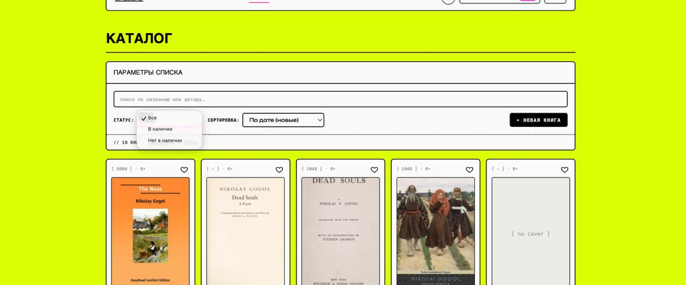

#### Поиск с подсветкой

При вводе текста в поле поиска найденные символы выделяются в названиях и
именах авторов. Дебаунс 250 мс — фильтрация срабатывает после паузы в наборе,
что избавляет от лишних перерисовок.

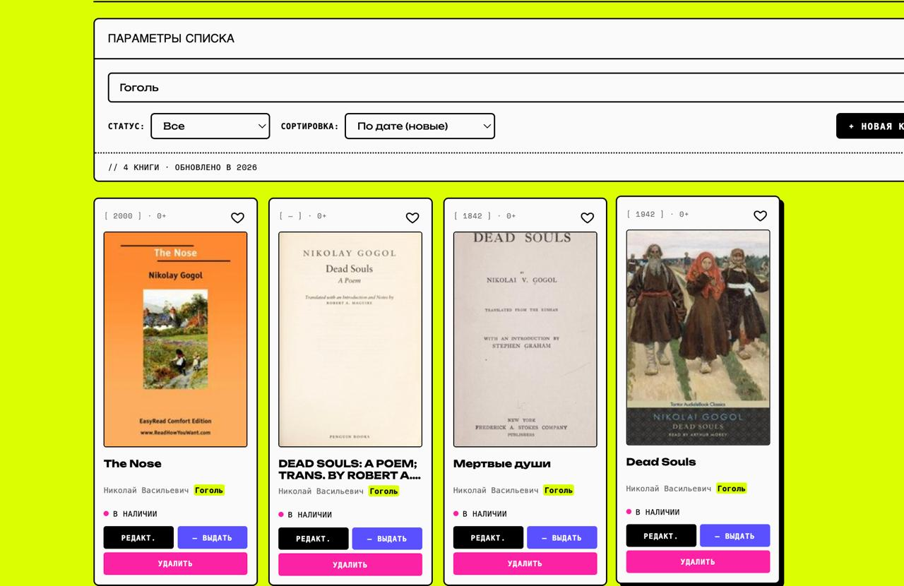

### Детальная страница книги `/books/:id`

- Большая обложка, мета-информация (издательство, год, категория, дата добавления).
- **Жанровые теги** — приходят из Open Library при импорте.
- Блок **«Похожие книги»** — топ-4 книги с пересекающимися тегами, либо того
  же автора если тегов нет.
- Кнопка «В избранное» доступна всем; «Редактировать/Удалить» — только админу.


### Форма создания и редактирования

Все поля по ТЗ (ГОСТ 2018):

| Поле | Элемент | Особенности |
|---|---|---|
| Заголовок | `<input>` + `v-model.trim` | Обязательное, мин. 2 символа |
| Автор | `<input>` + `v-model.trim` | Обязательное, мин. 2 символа |
| Описание | `<textarea>` | Необязательное |
| Издательство | `<select>` | Выбор из списка |
| Год | `<input type="number">` + `.number` | Числовая проверка, 0–2100 |
| Категория | `<input type="radio">` | 0+, 6+, 12+, 16+, 18+ |
| В наличии | `<input type="checkbox">` |  |
| Обложка | `<input type="file">` + **drag-and-drop** | jpg/jpg/webp, до 5 МБ |

Загрузка обложки реализована через перетаскивание (или клик):

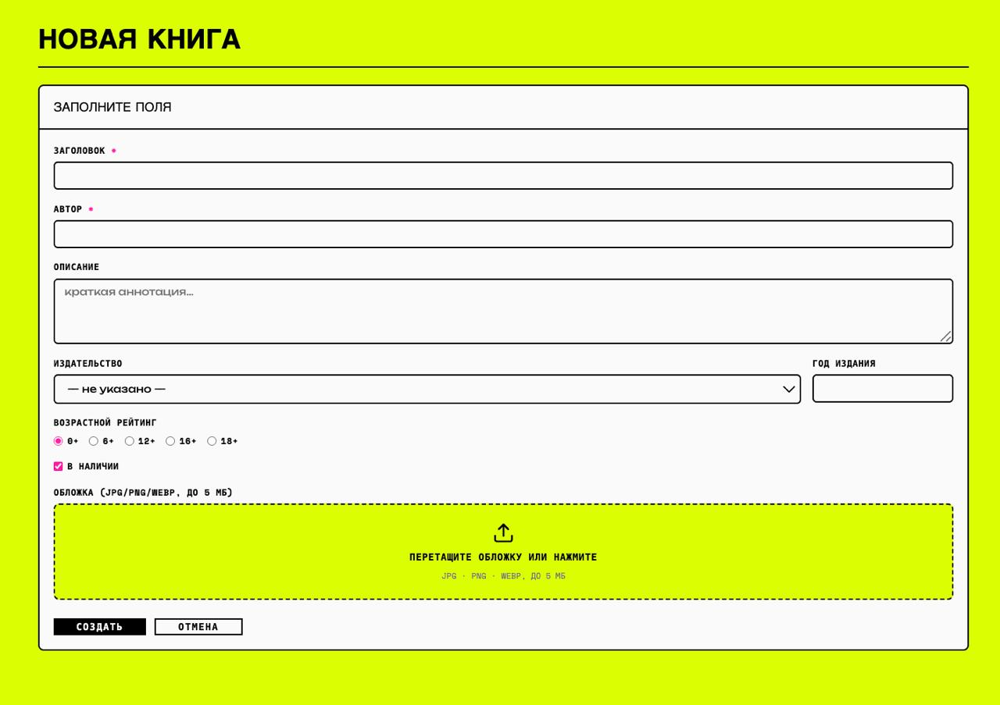

В момент перетаскивания зона подсвечивается малиновым:

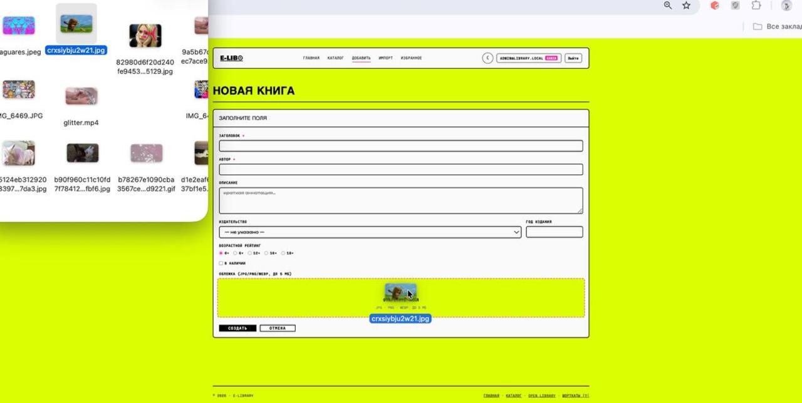

Редактирование использует тот же компонент `BookForm`, с предзаполненными
данными через prop `initial`:

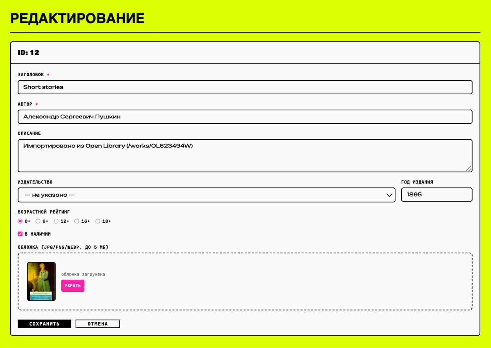

### Импорт из Open Library `/books/import`

Этот маршрут является **вложенным** (children в `/books`) — соответствует
требованию ТЗ по вложенной маршрутизации.

- Поле поиска шлёт запрос на бэкенд, который проксирует его в Open Library API
  с явно указанным параметром `fields=...,subject` (без него теги не приходят).
- На карточке кнопка «+ Импортировать» — одним кликом книга добавляется в нашу
  SQLite со всеми данными и тегами.
- Уже импортированные книги (по комбинации `title|author`) помечаются «✓ В каталоге».

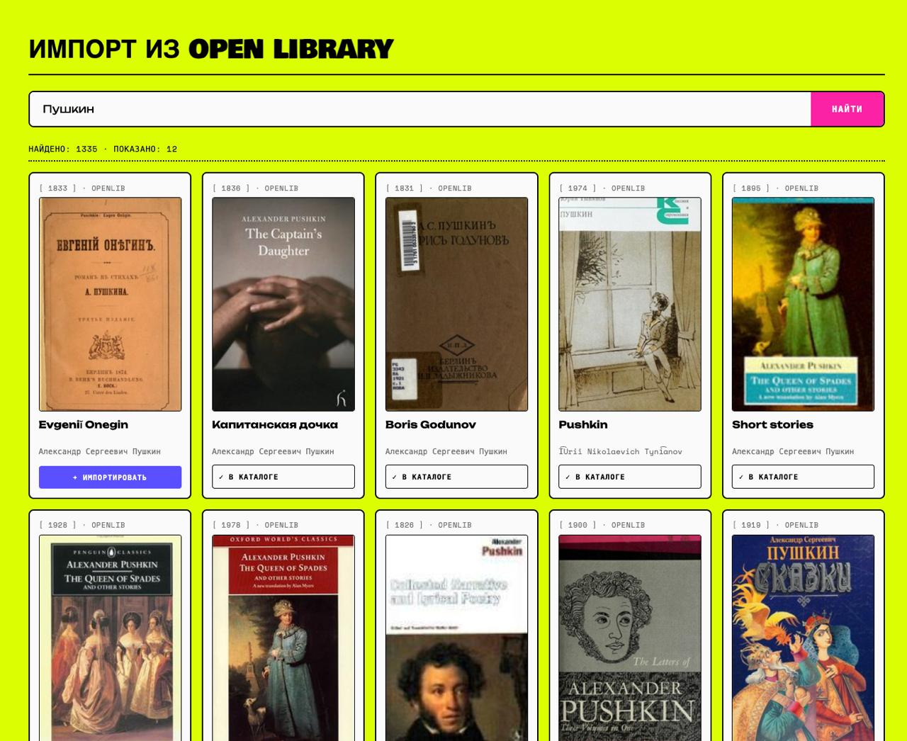

### Избранное `/favorites` — гибридное хранение

- **Гость** (не залогинен) — избранное хранится в `localStorage` этого браузера.
- **Авторизованный** — избранное в БД (таблица `favorites` с FK на users.id и
  books.id), синхронизируется между устройствами.
- **При логине** — все локальные ID отправляются на бэк через
  `POST /api/favorites/merge`, сливаются с серверным списком, локальный кэш чистится.
- **При логауте** — локальное состояние очищается, чтобы следующий гость не видел
  чужие сердечки.

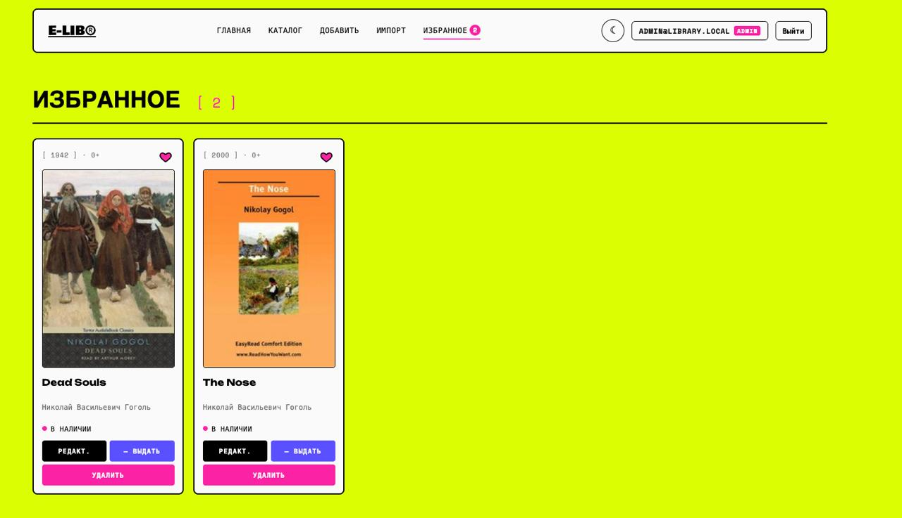

### Профиль `/profile`

Доступен только авторизованным. Показывает:

- Аватарку с первой буквой email
- Email, ID пользователя, роль
- Бейдж «ADMIN» для администратора
- Количество книг в избранном
- Список возможностей с галочками/крестиками в зависимости от роли
- Кнопку выхода

Обычный пользователь:

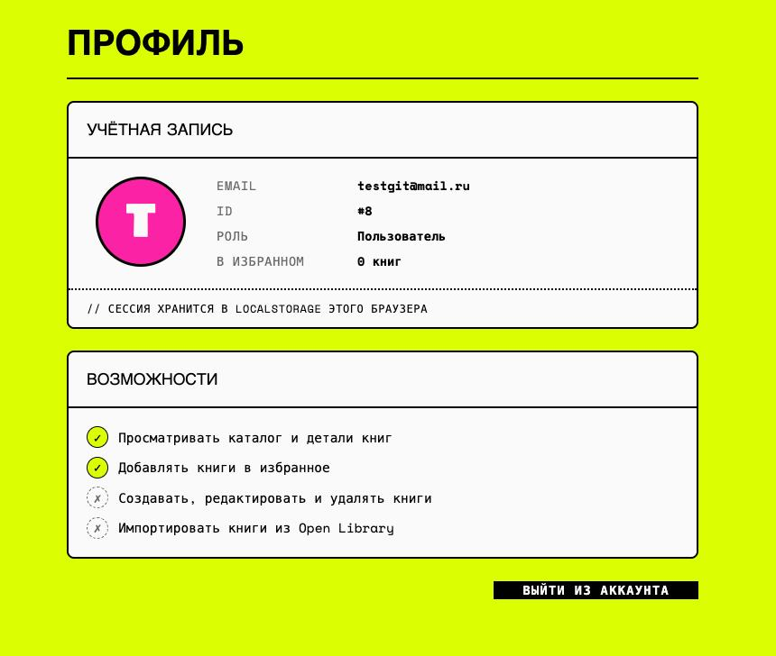

Администратор:


### Регистрация и вход

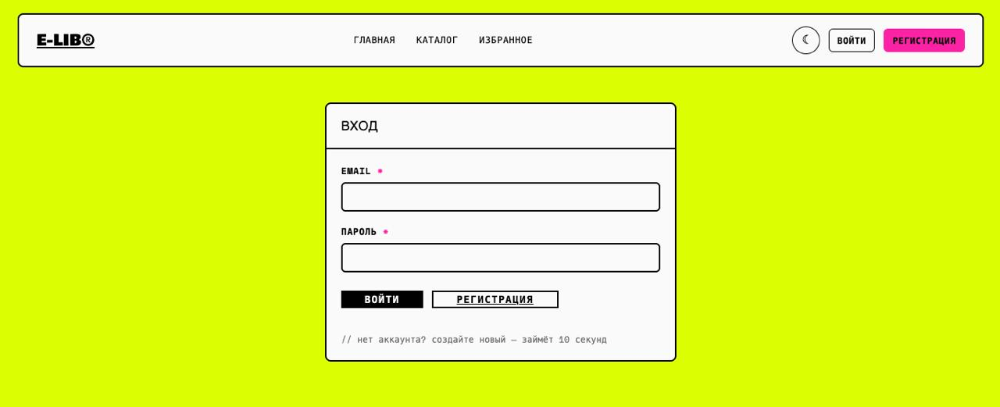

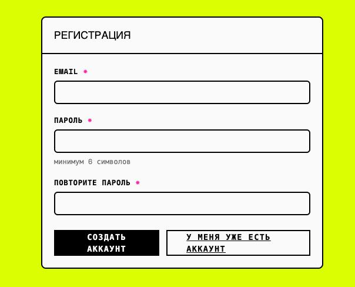

### Страница 404

Срабатывает на любой неизвестный URL через catch-all маршрут
`/:pathMatch(.*)*`. Стилизована в общем дизайне.


---

## 7. Роли и права доступа

В системе три уровня доступа:

| Уровень | Email | Может |
|---|---|---|
| **Гость** | — | Видеть каталог и детальные страницы, добавлять в избранное (хранится в localStorage) |
| **User** | любой зарегистрированный | Всё то же + избранное в БД (синхронизация между устройствами) |
| **Admin** | `admin@library.local` | Всё то же + CRUD книг, импорт из OpenLibrary, загрузка обложек |

### Как назначается админ

Админ создаётся **автоматически при первом старте бэкенда** (фиксированный
аккаунт):

```
email:    admin@library.local
password: admin1234
```

Email и пароль можно переопределить через переменные окружения `ADMIN_EMAIL`
и `ADMIN_PASSWORD`. Никакие другие пользователи не могут стать админами через
интерфейс — это намеренное ограничение для учебного проекта.

### Защита маршрутов на фронте

В `router/index.js` глобальный `beforeEach` проверяет `meta.requiresAuth` и
`meta.requiresAdmin`:

```js
router.beforeEach((to, from, next) => {
  const user = JSON.parse(localStorage.getItem('electolibrary:user') || 'null')
  const isAuth  = !!localStorage.getItem('electolibrary:token') && !!user
  const isAdmin = !!user?.is_admin

  if (to.meta.requiresAdmin && !isAdmin) return next({ name: 'books' })
  if (to.meta.requiresAuth  && !isAuth)  return next({ name: 'login', query: { next: to.fullPath } })
  next()
})
```

### Защита эндпоинтов на бэке

В `auth.py` определены два DI-хелпера:

- `get_current_user` — извлекает user из JWT-токена, либо `401`.
- `require_admin` — то же + проверка `user.is_admin`, либо `403`.

CRUD-эндпоинты книг (`POST/PUT/DELETE`) и загрузка обложек защищены через
`Depends(require_admin)`. GET-эндпоинты открыты всем.

---

## 8. API сервера

Полная интерактивная документация — Swagger UI по адресу
`http://localhost:8000/docs` после запуска бэкенда.

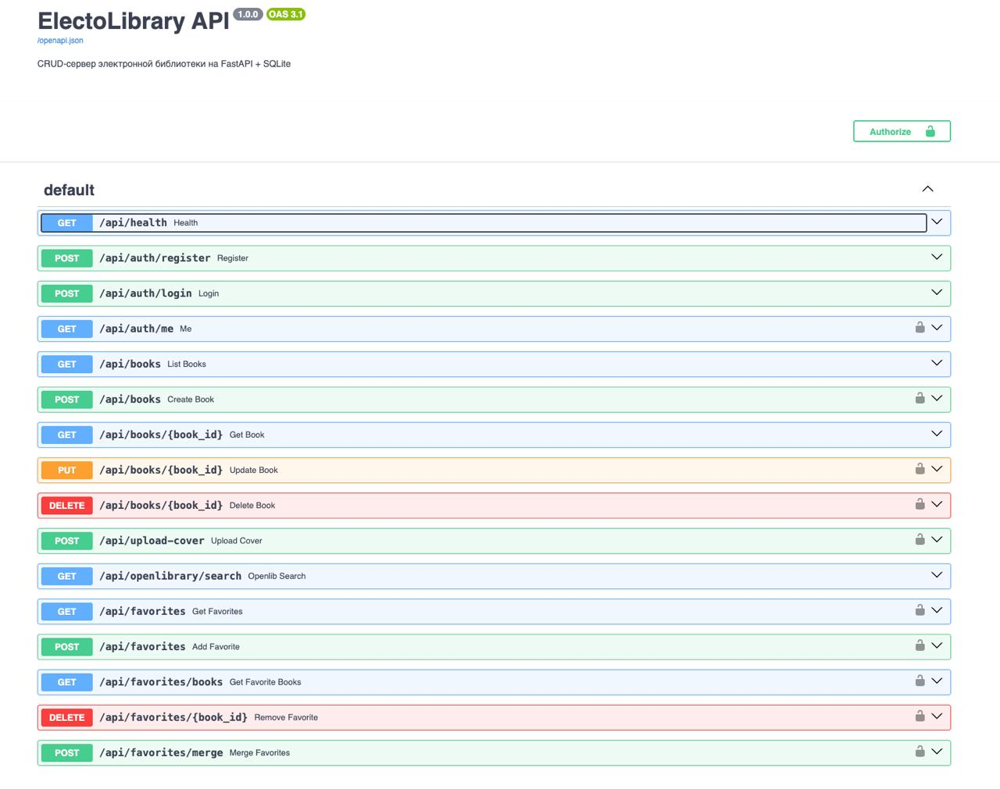

### Эндпоинты

| Метод | Путь | Доступ | Описание |
|---|---|---|---|
| `GET` | `/api/health` | публичный | Health-check |
| **Аутентификация** |||
| `POST` | `/api/auth/register` | публичный | Регистрация (всегда создаёт user, не admin) |
| `POST` | `/api/auth/login` | публичный | Логин по email/паролю, возвращает JWT |
| `GET` | `/api/auth/me` | auth | Данные текущего пользователя |
| **Книги** |||
| `GET` | `/api/books` | публичный | Список с фильтрами `?in_stock=`, `?sort=` |
| `GET` | `/api/books/{id}` | публичный | Одна книга или 404 |
| `POST` | `/api/books` | **admin** | Создание |
| `PUT` | `/api/books/{id}` | **admin** | Обновление |
| `DELETE` | `/api/books/{id}` | **admin** | Удаление (с каскадом на favorites) |
| **Обложки** |||
| `POST` | `/api/upload-cover` | **admin** | Загрузка файла (jpg/jpg/webp, до 5 МБ) |
| `GET` | `/uploads/{name}` | публичный | Отдача файла обложки |
| **Open Library** |||
| `GET` | `/api/openlibrary/search` | публичный | Прокси-поиск в Open Library API |
| **Избранное** |||
| `GET` | `/api/favorites` | auth | Список ID избранных книг |
| `GET` | `/api/favorites/books` | auth | Полные объекты избранных книг |
| `POST` | `/api/favorites` | auth | Добавить в избранное (идемпотентно) |
| `DELETE` | `/api/favorites/{book_id}` | auth | Убрать из избранного |
| `POST` | `/api/favorites/merge` | auth | Слияние локального избранного с серверным |

### Модели данных

**Book** (`models.Book`):
```python
id, title, author, description, publisher, year, category,
cover_url, subjects (CSV), in_stock, created_at
```

**User** (`models.User`):
```python
id, email (unique), hashed_password, is_admin, created_at
```

**Favorite** (`models.Favorite`):
```python
id, user_id (FK→users.id, CASCADE), book_id (FK→books.id, CASCADE), created_at
# UniqueConstraint(user_id, book_id) — одна книга не может быть добавлена дважды
```

---

## 9. Реализованные возможности Vue 3

### 9.1. Компоненты

| Компонент | Демонстрирует |
|---|---|
| `AppHeader.vue` | RouterLink, реактивное переключение между ролями |
| `AppFooter.vue` | **Именованный слот** `links` |
| `LayoutCard.vue` | **Все три типа слотов**: дефолтный, именованный `header`, **scope-слот** `footer` с переданными `year` и `items` |
| `BookItem.vue` | Props, emits, computed (`coverUrl`, `fav`), refs (`favBtn`) для анимации |
| `BookList.vue` | Props (массив), проброс событий вверх через `$emit('event', $event)` |
| `BookForm.vue` | `v-model.trim` и `.number`, refs (`fileInput`), watch с `immediate: true` |
| `ToastContainer.vue` | `Teleport`, `TransitionGroup` |
| `ShortcutsHelp.vue` | `Teleport`, `Transition` |

### 9.2. Маршрутизация

Все требования ТЗ покрыты:

| Маршрут | Имя | Тип |
|---|---|---|
| `/` | `home` | статический именованный |
| `/books` | `books` | именованный |
| `/books/import` | `books-import` | **вложенный** |
| `/books/new` | `book-new` | защищённый `requiresAdmin` |
| `/books/:id` | `book-detail` | **динамический с `props: true`** |
| `/books/:id/edit` | `book-edit` | динамический + admin-only |
| `/favorites` | `favorites` | именованный |
| `/login` | `login` | публичный |
| `/register` | `register` | публичный |
| `/profile` | `profile` | защищённый `requiresAuth` |
| `/:pathMatch(.*)*` | `not-found` | **catch-all для 404** |

**Программная навигация** — в `BooksView.confirmDelete`, `BookFormView.onSubmit`
и других местах:
```js
this.$router.push({ name: 'book-edit', params: { id: book.id } })
```

### 9.3. Computed / Watch / Refs / Lifecycle

**Computed** — реактивные производные:
- `BooksView.filteredBooks` — фильтр + поиск + сортировка в одной функции.
- `BookDetailView.similarBooks` — алгоритм поиска похожих книг.
- `AppHeader.shortEmail` — обрезка длинного email.

**Watch**:
- `BooksView.searchQuery` с **debounce-логикой через `clearTimeout`/`setTimeout`** (250 мс).
- `BookForm.initial` с `immediate: true` — подхват асинхронно пришедших данных.
- `BookDetailView.id` с `immediate: true` — перезагрузка при переходе между похожими.
- `FavoritesView.isAuthenticated` — перезагрузка списка при смене авторизации.

**Refs**:
- `BookForm.$refs.fileInput` — программная очистка `<input type="file">`.
- `BookItem.$refs.favBtn` — точка старта для анимации летящего сердца.

**Lifecycle**:
- `mounted()` — начальная загрузка данных в большинстве views.
- `beforeUnmount()` — очистка таймера дебаунса, отписка от scroll-события в ScrollToTop.

### 9.4. Слоты — все три типа

Реализованы в `LayoutCard.vue`:

```vue
<slot name="header" />               <!-- именованный -->
<slot />                             <!-- дефолтный -->
<slot name="footer"
      :year="currentYear"
      :items="itemsCount" />         <!-- scope-слот -->
```

Использование scope-слота в `BooksView`:

```vue
<template #footer="{ year, items }">
  // {{ items }} {{ pluralBooks(items) }} · обновлено в {{ year }}
</template>
```

В `AppFooter.vue` — именованный слот `links`, наполняемый из `App.vue`.

### 9.5. Composables (Composition API)

Шесть собственных composables:

| Composable | Что делает |
|---|---|
| `useAuth` | JWT-сессия: login/register/logout/refreshUser, реактивные `isAuthenticated`/`isAdmin` |
| `useFavorites` | Гибридное хранение избранного, merge при логине |
| `useTheme` | Светлая/тёмная тема, сохранение выбора, респект системных предпочтений |
| `useToast` | Глобальная очередь toast-уведомлений с авто-удалением |
| `useShortcuts` | Клавиатурные шорткаты на window, обработка вложенных комбинаций (g→h) |
| `useFlyingHeart` | DOM-анимация летящего сердца при добавлении в избранное |

Все composables используют один общий `reactive` state на уровне модуля
(singleton-pattern) — любой компонент, вызывающий хук, подписан на изменения.

---

## 10. UI/UX фичи

Сверх требований ТЗ добавлены:

### 🍞 Toast-уведомления

Кастомная система всплывающих сообщений вместо `alert()`/`confirm()`. Четыре
типа: success, error, warning, info. Автозакрытие через 3.5 с, можно кликнуть
для немедленного закрытия. Анимация появления/исчезновения через
`<TransitionGroup>`.

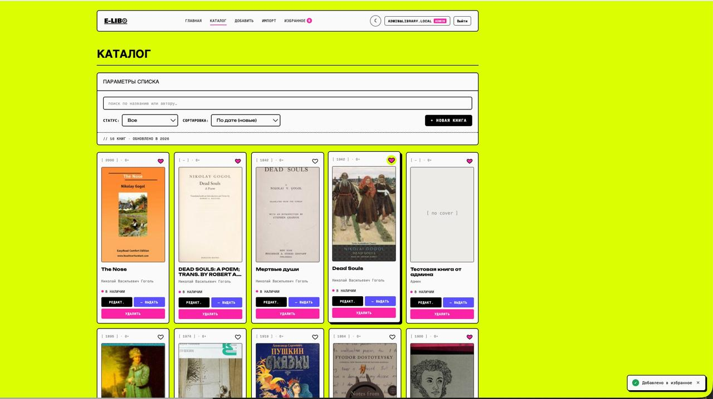

### ✨ Page transitions

Плавные переходы между маршрутами через Vue `<Transition>` с режимом `out-in`.
Опасити + лёгкий вертикальный сдвиг — 250 мс.

### 💀 Skeleton loaders

Пульсирующие плейсхолдеры в форме карточек книг — отображаются вместо
скучного «загружаем…» во время сетевых запросов. Используется CSS-shimmer.

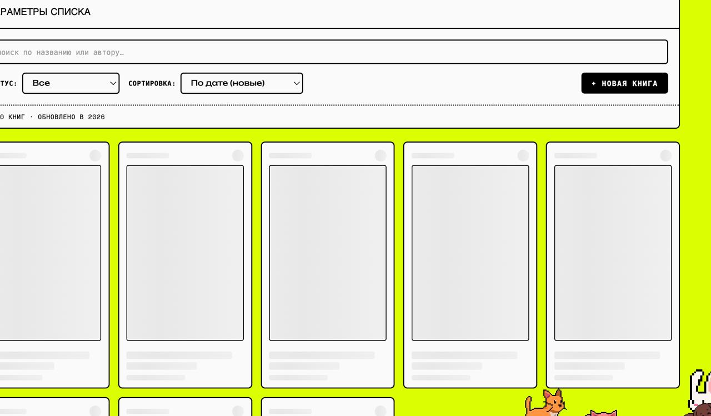

### 🌗 Тёмная тема

Переключатель в шапке (☾/☀). Реализована через CSS-переменные:
один набор переменных в `:root`, второй в `html[data-theme="dark"]`. При
первом визите тема определяется по `prefers-color-scheme`, потом сохраняется
в localStorage.


### ❤️‍🔥 Летящее сердечко

При клике на сердечко в карточке от него летит миниатюрная копия по плавной
кривой к иконке «Избранное» в шапке. По прибытии иконка пульсирует. SVG-элемент
создаётся через `document.createElement`, удаляется по завершении.

### 🎯 Drag-and-drop загрузка обложек

Большая dropzone вместо стандартного `<input type="file">`. Можно перетащить
картинку из Finder/Explorer. Во время drag-over зона подсвечивается малиновым.
Во время загрузки — спиннер. После загрузки — превью с кнопкой удаления.

### ⌨️ Keyboard shortcuts

Глобальные шорткаты регистрируются один раз в `main.js`:

| Клавиша | Действие |
|---|---|
| `/` | Фокус на поле поиска |
| `?` | Показать справку шорткатов |
| `Esc` | Снять фокус / закрыть модалку |
| `G` `H` | Главная |
| `G` `C` | Каталог |
| `G` `F` | Избранное |
| `G` `P` | Профиль |

Двухклавишные сочетания работают с таймаутом 800 мс. Шорткаты игнорируются
внутри input/textarea.

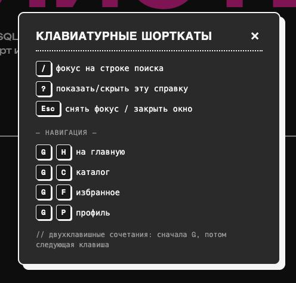

### 🎨 Подсветка поисковых совпадений

При вводе текста в поиск каталога найденные подстроки выделяются `<mark>`-ом.
Регистронезависимо. В светлой теме — жёлто-зелёным, в тёмной — малиновым.

### 🖼️ Empty states с SVG-иллюстрациями

Все пустые состояния (пустое избранное, нет результатов поиска, пустой импорт)
оформлены через компонент `EmptyState.vue` с подходящей векторной иллюстрацией
(книга, лупа, сердце) и call-to-action кнопкой.

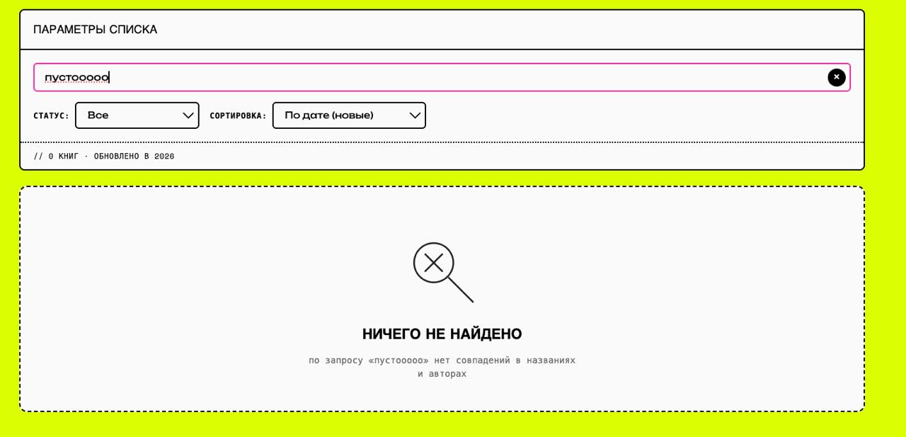

### 🚀 Scroll-to-top кнопка

Малиновая круглая кнопка с чёрной обводкой появляется в правом нижнем углу
после 400 px скролла. Плавная прокрутка наверх по клику. Анимация появления/
исчезновения через `<Transition>`.

---

## 11. Инструкция по запуску

### Вариант 1 — Docker (рекомендуется)

Требование: установлен **Docker Desktop**.

```bash
git clone https://github.com/tessaiqo/electolibrary.git
cd electolibrary
docker compose up --build
```

Открыть в браузере:
- **http://localhost** — приложение
- **http://localhost:8000/docs** — Swagger UI

Остановка:
```bash
docker compose down
```

Данные сохраняются между перезапусками благодаря volume-маунтам
(`./data:/app/data` и `./uploads:/app/uploads`).

### Вариант 2 — локальный запуск

Требования: **Node.js 20+**, **Python 3.12+**.

**Бэкенд** (терминал 1):

```bash
cd backend
python3 -m venv venv
source venv/bin/activate         # на Windows: venv\Scripts\activate
pip install -r requirements.txt
uvicorn main:app --reload --port 8000
```

**Фронтенд** (терминал 2):

```bash
cd frontend
npm install
npm run dev
```

Открыть **http://localhost:3000**. Vite-сервер сам проксирует `/api` на
`localhost:8000` (см. `vite.config.js`).

### Первый вход

При первом старте бэкенд автоматически создаёт админа:

```
email:    admin@library.local
password: admin1234
```

Войдите под этими данными, чтобы получить доступ к админским функциям
(создание/редактирование/удаление книг, импорт).

Можно также зарегистрировать обычного пользователя на странице
`/register` — он не получит админских прав.

### Production-сборка фронта (без Docker)

```bash
cd frontend
npm run build           # результат в dist/
npm run preview         # быстрая проверка production-сборки
```

### Переменные окружения бэкенда

Можно переопределить через env при запуске:

```bash
ADMIN_EMAIL=root@example.com \
ADMIN_PASSWORD=verystrongpass \
JWT_SECRET=very-long-random-string-min-32-chars \
uvicorn main:app
```

---

## 12. Тестирование

### Ручные сценарии

**Гость:**
1. Открыть `/books` — каталог виден.
2. Кликнуть на сердечко — добавляется в localStorage.
3. Попытаться открыть `/books/new` напрямую — редирект на `/books`.

**Регистрация и вход:**
1. `/register` → создать аккаунт → автоматический логин.
2. В localStorage появляются `electolibrary:token` и `electolibrary:user`.
3. Локальное избранное **сливается** с серверным (если что-то было).

**Админ:**
1. Логин `admin@library.local` / `admin1234`.
2. В шапке появляются «Добавить», «Импорт», бейдж «ADMIN».
3. На карточках появляются кнопки управления.
4. `POST /api/books` через интерфейс → книга появляется в каталоге и в БД.

**Каскадное удаление:**
1. Юзер добавил книгу в избранное.
2. Админ удалил эту книгу.
3. Запись из `favorites` пропадает автоматически (FK CASCADE).

### Swagger

Все эндпоинты можно протестировать через Swagger UI на
`http://localhost:8000/docs` — авторизация через кнопку **Authorize** в
правом верхнем углу.

### DB Browser

Содержимое БД смотрится через DB Browser for SQLite:

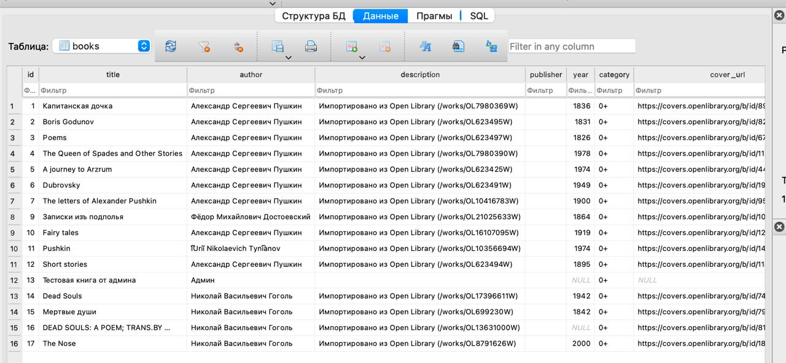

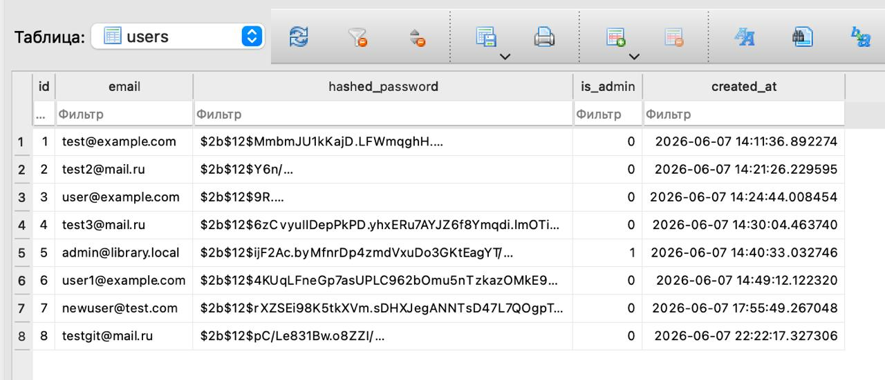

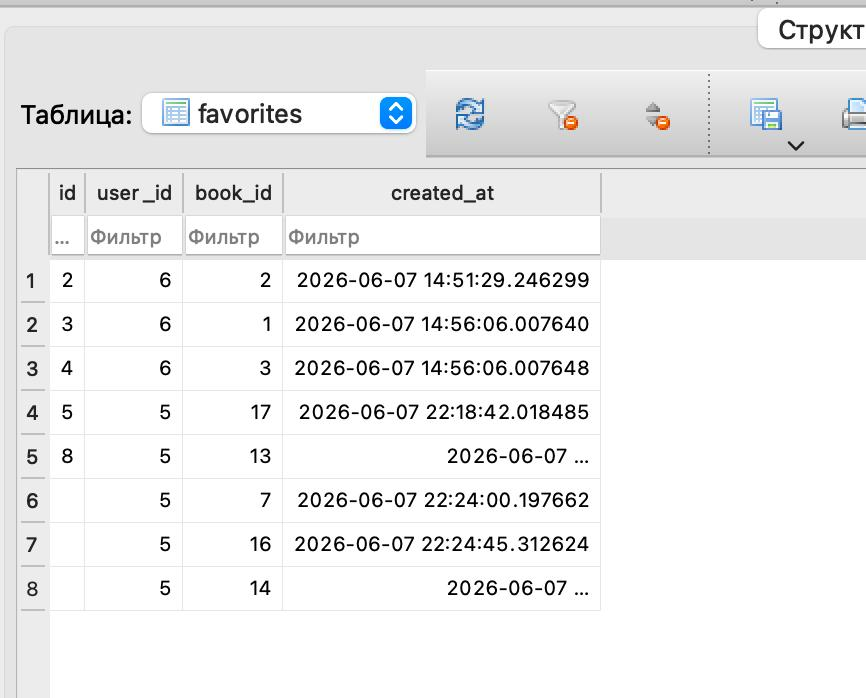

---

## 13. Скриншоты

### Главная (светлая и тёмная темы)


### Каталог и поиск


### Книга


### Избранное и импорт


### Авторизация и профиль


### UX-фичи


### Бэкенд и БД


---

## 14. Безопасность

- **Пароли** хешируются bcrypt (cost factor 12) — пароли в открытом виде нигде
  не хранятся и не логируются.
- **JWT** подписаны HS256, ключ берётся из env (`JWT_SECRET`) с дефолтом для
  dev-режима. Срок действия — 7 дней.
- **CORS** ограничен `localhost:3000`, `localhost:80`, `localhost`.
- **Валидация на бэке** — Pydantic-схемы со строгими типами, `Field(...)`
  с ограничениями длины и `pattern` для категории.
- **Загрузка файлов** — проверка расширения (только jpg/jpg/webp), размера
  (макс. 5 МБ), генерация UUID-имени (никаких user-supplied имён).
- **SQL-инъекции невозможны** — везде ORM SQLAlchemy с параметризованными
  запросами, никаких raw SQL.
- **403 vs 401** — корректное разделение: 401 для незалогиненных, 403 для
  залогиненных без прав.

---

## 15. Возможные расширения

Для прода стоило бы добавить:

- **PostgreSQL** вместо SQLite для конкурентного доступа.
- **Refresh tokens** + httpOnly cookies вместо localStorage (защита от XSS).
- **Rate limiting** на чувствительные эндпоинты (login, register).
- **Email-верификация** при регистрации.
- **Пагинация** для длинных каталогов.
- **Кэширование** ответов Open Library API (Redis или встроенный LRU).
- **Pytest + Vitest** для покрытия тестами.
- **GitHub Actions CI** — автосборка и проверка при пуше.
- **S3-совместимое хранилище** для обложек вместо локального диска.
- **Audit log** — кто/когда/что менял в каталоге.

---

## 16. Выводы

В ходе работы освоены и применены:

- **Vue 3** — Options API и Composition API, реактивная привязка, computed,
  watch, refs, lifecycle hooks, slots всех трёх типов.
- **Composables** — единый паттерн переиспользуемой бизнес-логики; шесть
  собственных хуков покрывают аутентификацию, избранное, тему, тосты, шорткаты,
  анимации.
- **Vue Router 4** — статические, динамические, вложенные и именованные
  маршруты; программная навигация; navigation guards для защиты приватных
  страниц; 404 через catch-all.
- **Формы** — двусторонняя привязка, модификаторы (`.trim`, `.number`),
  ручная валидация, загрузка файлов через `FormData`, drag-and-drop.
- **REST API** — спроектирован полноценный CRUD по REST-конвенциям,
  корректные статус-коды (201, 204, 401, 403, 404, 409).
- **FastAPI** — асинхронные эндпоинты, Pydantic-валидация, dependency
  injection (`Depends(get_db)`, `Depends(require_admin)`), автогенерация Swagger UI.
- **JWT-аутентификация** — bcrypt для паролей, токены с истечением,
  опциональная и обязательная авторизация через DI.
- **SQLAlchemy 2.x** — современный синтаксис с `Mapped[T]`, сессии, ORM-запросы,
  FK с каскадным удалением, уникальные ограничения.
- **Docker** — multi-stage сборка фронта (Node → Nginx, итоговый образ ~25 МБ),
  оркестрация через compose, volumes для персистентности, общая сеть для
  коммуникации по DNS-имени `backend`.
- **Структурирование SPA-проекта** — разделение на views/components/services/
  composables; изоляция бизнес-логики от UI.

Дополнительно реализованы продакшн-уровневые UX-фичи: тёмная тема, toast-
уведомления, skeleton-loaders, page transitions, drag-and-drop, клавиатурные
шорткаты, подсветка поисковых совпадений, анимации.

---

## 17. Источники

- [Vue 3 Documentation](https://vuejs.org/)
- [Vue Router 4](https://router.vuejs.org/)
- [Vite](https://vitejs.dev/)
- [FastAPI](https://fastapi.tiangolo.com/)
- [SQLAlchemy 2.0](https://docs.sqlalchemy.org/en/20/)
- [Pydantic v2](https://docs.pydantic.dev/)
- [python-jose (JWT)](https://github.com/mpdavis/python-jose)
- [Open Library Developers — Search API](https://openlibrary.org/developers/api)
- [Docker Compose](https://docs.docker.com/compose/)